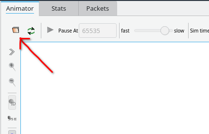

# Hidden And Exposed Terminal Problem
**Hidden Terminal Problem** occurs when a node is not in range of the sender of data but is in the range of the receiver. When two such unaware nodes start to transmit data to the common receiver data collision occurs. To avoid this problem one can use RTS/CTS control packets. 

**Exposed Terminal Problem** occurs when a node is communicating with a node and due to this some other node is unable to communicate with some different node because the former node is in the range of one of the nodes which are communicating. The node becomes exposed to its neighbor node. To avoid this problem one can use RTS/CTS control packets.

## Requiremnets
* ns-3 v3.35
* NetAnim v3.108


## Packages required on Fedora 35
    dnf install clang cmake qt5-qtbase-devel

## ns-3
1. Move the `*.cc` file in `scratch` folder in ns-3.35
2. Now from the ns-3.35 folder you can run the programs using

    ./waf --run scratch/<ProgramName>.cc

    This command runs the program and also generates a `<ProgramName.xml>` file which then used in the NetAnim.

## NetAnim
1. Now move to the netanim-3.108
2. Run `./NetAnim`
3. Click on `Open XML trace file`
   
    
4. And select the `<Program.xml>` file you want to run.

### Directory strcuture
```
ns-allinone-3.35 
│
└───ns-3.35
│   │   ExposedTerminal.xml // Generated file
|   |   HiddenTerminal.xml  // Generated file
|   |
│   └───scratch
|       |   ExposedTerminal.cc
│       │   HiddenTerminal.cc
│   
└───netanim-3.108
    │   NetAnim
```